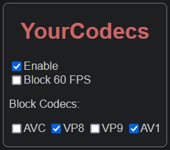

#  YourCodecs 你的編碼

<del>在茫茫影片中，尋找從未支援的編碼。</del>

[English](./README.md)

為什麼有些 YouTube 影片讓我的瀏覽器卡頓、電腦發熱、散熱風扇轉得像是要起飛？也許是影片選擇了您的電腦不支援的視訊編碼。

這是一個 Firefox 擴充套件，可以讓您選擇 YouTube 的影片編碼。強制 YouTube 使用 H.264 (AVC), VP9, AV1 視訊編碼。

## 壹覽無遺

## 功能

- 可選擇不允許的編碼 AVC、VP8、VP9 和 AV1；
- 可選擇不允許 60 FPS；
- 暗黑介面；
- 語言支援：英語、正體中文。

> :warning: 如果封鎖了所有編解碼器，YouTube 將會顯示「Your browser can't play this video.」，這是正常的運作。

> 若要強制使用 AV1，需允許 VP9 和 AV1 選項（取消選中）。原因不明。

> 有時需要進行強制刷新，即 `Ctrl + F5`。

## 為什麼 YourCodecs？

YouTube 一直採用尖端技術。從 AVC 到 VP8、VP9，再到現在的 AV1，其最新的視訊壓縮解碼器（Codec）承諾提供增強的性能和優質的壓縮效果。然而，如果遇到硬體（GPU）不支持的解碼器，將會使用軟體解碼，極大地消耗 CPU 資源。這可能導致設備過熱、性能下降，以及電池壽命縮短，特別是在「老舊」設備上。儘管 YouTube 通常會自動為您選擇解碼器，但這並不總是如您所願。

## 如何查看當前影片的編碼？

右鍵你的 YouTube 播放器，選擇「統計資料」，你會看到「Codecs」欄位記載視訊和音訊編碼，VP9、AV1 可能是以 `VP09`、`AV01` 開頭的標記。

## 我的硬體支援新的編碼嗎？

確定您的硬體是否支持最新的編解碼器有多種方法。一種方法是在線搜索您設備的規格。或者，您可以在播放 YouTube 影片時檢查「工作管理員」。如果您的硬體與正在使用的編解碼器兼容，則在播放期間應該會觀察到「Video Encode」圖表的增長。

## 許可

程式碼修改（分叉）自 [erkserkserks/h264ify](https://github.com/erkserkserks/h264ify)，它以 MIT 許可證釋出。

修改過的版本仍然以 MIT 許可證釋出。

## 參考

- GitHub - [erkserkserks/h264ify](https://github.com/erkserkserks/h264ify): 原始版本；
- GitHub - [Shimmermare/NotYetAV1](https://github.com/Shimmermare/NotYetAV1): 另一個 h264ify 的分叉，僅阻擋 AV1；
- GreasyFork - [burlaka/Youtube H.264 (updated 2020)](https://greasyfork.org/zh-TW/scripts/415692-youtube-h-264-updated-2020): 一個 UserScript 僅選擇 H.264(AVC)。

## 註記

- 我沒辦法測試 VP8 因為我找不到還在用 VP8 編碼的影片，但應該能跑：）
- UserScript 版本無法在 GreaseMonkey 上運行，但 ViolentMonkey 可以。
